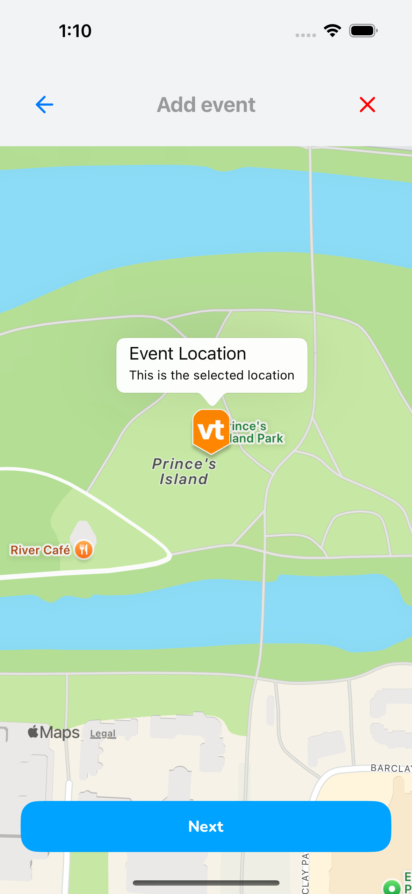

# Volunteam App

<p align="center">
    
    
    
</p>

**Volunteam** is a mobile app where users can find events that need volunteers, apply to those events and become part of the events' teams

## Setting up the fake API (json-server)

Update the file `src/services/api.ts`.

Before running your 'json-server', get your computer's IP address and update your baseURL to `http://your_ip_address_here:3333` and then run:

```
npx json-server --watch db.json --port 3333 --host your_ip_address_here -m ./node_modules/json-server-auth
```

To access your server online without running json-server locally, you can set your baseURL to:

```
https://my-json-server.typicode.com/<your-github-username>/<your-github-repo>
```

To use `my-json-server`, make sure your `db.json` is located at the repo root.

## Setting up the image upload API

Update the file `src/services/imageApi.ts`.

You can use any hosting service of your preference. In this case, we will use ImgBB API: https://api.imgbb.com/.
Sign up for free at https://imgbb.com/signup, get your API key and add it to the .env file in your root folder.

To run the app in your local environment, you will need to set the IMGBB_API_KEY when starting the app using:

```
IMGBB_API_KEY="insert_your_api_key_here" npx expo start
```

When creating your app build or publishing, import your secret values to EAS running:

```
eas secret:push
```

## Running mobile app

After running the *'json-server'*, run the mobile app with:

```
yarn start
```

Or

```
npx expo start
```

You can open the mobile app using the *'Xcode Simulator'* on Mac, *'Android Emulator'* on Android Studio, or *'Expo Go'* on your mobile phone.

- ***Simulator***: press `i` key
- ***Android Emulator***: press `a` key
- ***Expo Go***: scan the __qr code__ with your phone that has Expo Go installed

<hr />

### Event pages where the user can still sign up as volunteer and a map to get directions to event

<p align="center">


</p>

<hr />

### To add a new event, tap on the map location and a marker will appear. Press "Next" button.

<p align="center">


</p>

<hr />

### Fill up the form with the event details including uploading an image

<p align="center">

</p>

<hr />

### After filling up and submitting form, you will be redirected to the events map page with the new event marker and number or events updated

<p align="center">

</p>
